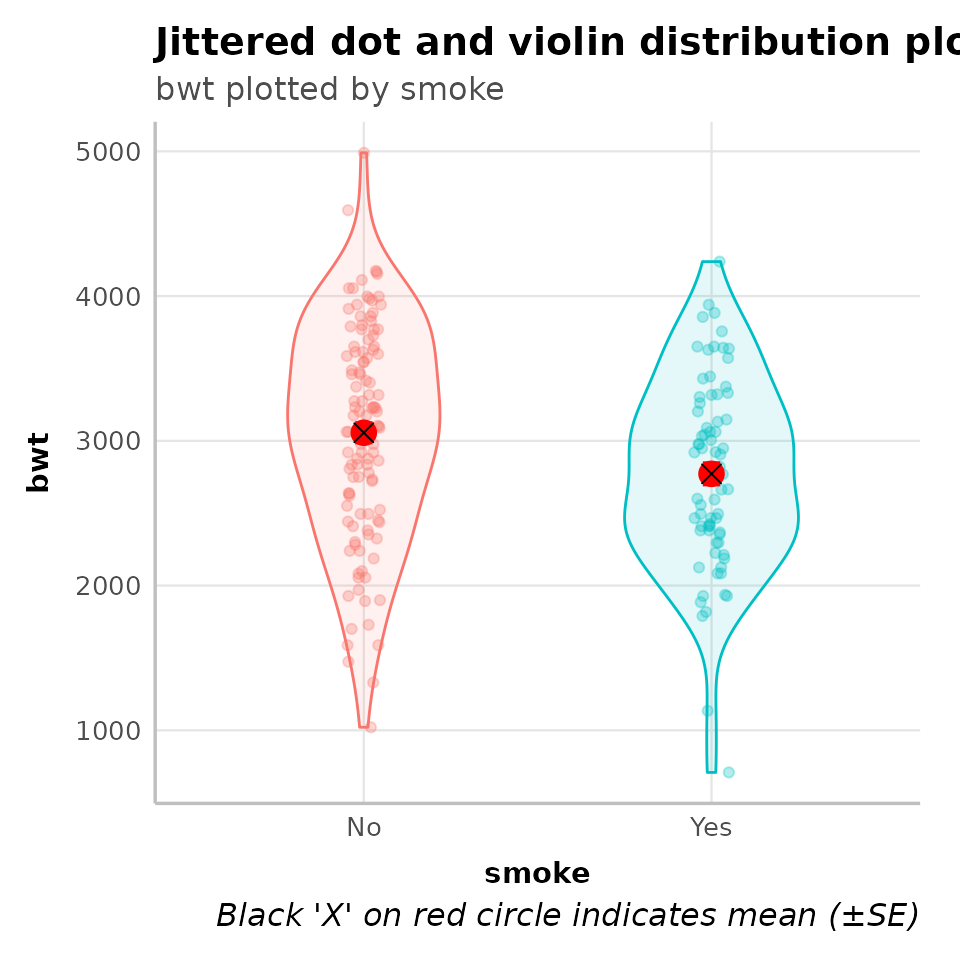
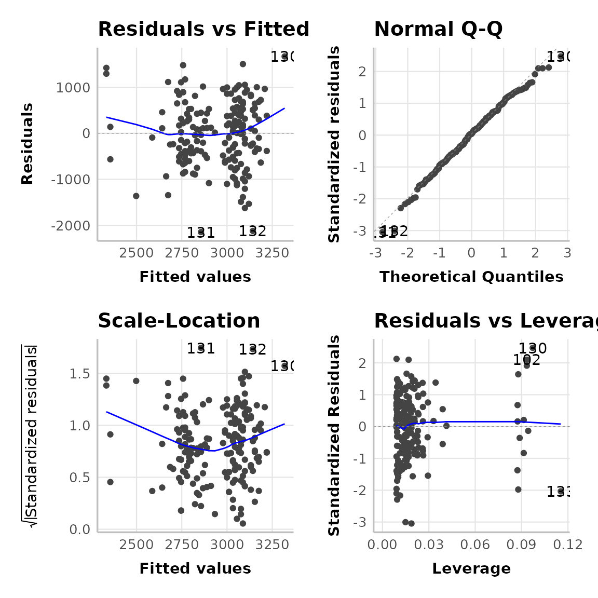
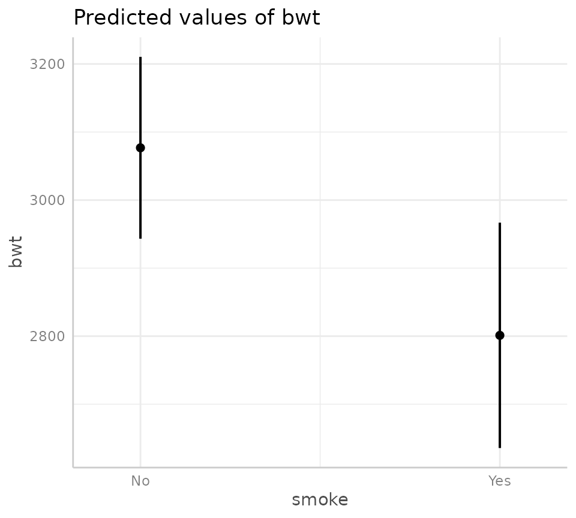

# Presenting Model Output

## Overview

``` r
library(thekidsbiostats)
```

We are constantly working on the appearance of the reports we generate
for our colleagues and collaborators. This includes managing `.html` and
`.docx` output for different use cases, all while navigating the move
from [R Markdown](https://rmarkdown.rstudio.com/) to
[Quarto](https://quarto.org/). At this stage, we have all but completely
abandoned the idea of rendering directly to `.pdf` as we find `.docx`
more friendly (tracking changes with collaborators, certain output
manipulating functions) and it is readily ‘pdf-able’ - but more on all
that in a future post.

Our primary report output format is `.html` and we have been looking for
ways to harness certain Quarto features to improve both the aesthetic of
our reports as well as our use of real estate. Often, we are presenting
output for a range of models separated by narration. It is important
that all models are presented with sufficient context (as opposed to
output just dumped on a page) and we’ve settled on what we think is a
nice way to ensure relevant information (like model diagnostics) are
readily available (and digestible) to the reader, as opposed to being
tucked away at the end — or worse — left out altogether.

Below, we present the way we currently present output from a linear
regression in our `.html` reports.

  

## Example Usage

To demonstrate, we will use a slightly modified dataset of Birth Weight
data (read more with
[`?MASS::birthwt`](https://rdrr.io/pkg/MASS/man/birthwt.html)) from the
`MASS` package
([`MASS::birthwt`](https://rdrr.io/pkg/MASS/man/birthwt.html)).

### Data

``` r
dat_bwt <- MASS::birthwt
```

The dataset has 189 observations (rows) and in the code below we just
tidy up some variables prior to running the model.

``` r
dat_bwt <- MASS::birthwt
dat_bwt <- dat_bwt %>% 
  tibble() %>% 
  mutate(smoke = factor(case_when(smoke == 1 ~ "Yes",
                                  smoke == 0 ~ "No",
                                  T ~ NA_character_)),
         ht = factor(case_when(ht == 1 ~ "Yes",
                               ht == 0 ~ "No",
                               T ~ NA_character_)))
```

### Building the model

We want to implement the following linear regression (`lm`) model:

- **Outcome:** infant birth weight (`bwt`).
- **Exposure of interest:** maternal smoking status during pregnancy
  (`smoke`).
- **Covariates:** maternal age (`age`) and history of hypertension
  (`ht`).

This model can be generated using the `thekids_model` function using the
code below:

``` r
mod_bwt <- dat_bwt %>% 
  thekids_model(y = "bwt", x = "smoke", formula = "age + ht")
#> Warning: `fortify(<lm>)` was deprecated in ggplot2 4.0.0.
#> ℹ Please use `broom::augment(<lm>)` instead.
#> ℹ The deprecated feature was likely used in the ggfortify package.
#>   Please report the issue at <https://github.com/sinhrks/ggfortify/issues>.
#> This warning is displayed once every 8 hours.
#> Call `lifecycle::last_lifecycle_warnings()` to see where this warning was
#> generated.
#> Warning: `aes_string()` was deprecated in ggplot2 3.0.0.
#> ℹ Please use tidy evaluation idioms with `aes()`.
#> ℹ See also `vignette("ggplot2-in-packages")` for more information.
#> ℹ The deprecated feature was likely used in the ggfortify package.
#>   Please report the issue at <https://github.com/sinhrks/ggfortify/issues>.
#> This warning is displayed once every 8 hours.
#> Call `lifecycle::last_lifecycle_warnings()` to see where this warning was
#> generated.
#> Warning: Using `size` aesthetic for lines was deprecated in ggplot2 3.4.0.
#> ℹ Please use `linewidth` instead.
#> ℹ The deprecated feature was likely used in the ggfortify package.
#>   Please report the issue at <https://github.com/sinhrks/ggfortify/issues>.
#> This warning is displayed once every 8 hours.
#> Call `lifecycle::last_lifecycle_warnings()` to see where this warning was
#> generated.
```

In this, we have passed (*piped*: `%>%`) the data into the first
argument, specified the outcome variable as `y`, the exposure of
interest as `x`, and finally the remainder of the models `formula` (that
is, the covariates we want to look at in our model).

Alternatively, we could run our model in the ‘normal’ way by passing it
into our output processing function `thekids_model_output` — the
workhorse of the function above — which would look like the following:

``` r
my_model <- lm(bwt ~ smoke + age + ht, data = dat_bwt)
thekids_model_output(my_model, by = "smoke") # still requires specifying the exposure of interest
```

The objects defined above (`mod_bwt`, `my_model`) are lists that contain
outputs relating to our selected model type.

Below, we will see how the output would appear in an `.html` report.

### Model output

#### Descriptive statistics

The table below shows summary statistics for all variables in the model
by the primary exposure variable (maternal smoking status in pregnancy).

``` r
mod_bwt$mod_desc %>% 
  thekids_table(colour = "DarkTeal",
                padding.left = 10, padding.right = 10)
#> Warning in check_font_family(font_family = font_family, fallback_family =
#> fallback_font_family): Font 'Barlow' not found; falling back to 'sans'.
```

[TABLE]

The figure below shows the distribution of the primary outcome variable
(infant birth weight) by the primary exposure variable (maternal smoking
status in pregnancy).

``` r
mod_bwt$mod_desc_plot
```



  

#### Model diagnostics

The four panel plot below shows diagnostic plots that can aid in
determining if the required assumptions of model are met. **Based on the
diagnostics below,** the model fit is deemed to be good.

``` r
mod_bwt$mod_diag
```



  

Broadly, what we are looking for in these plots (and why) are:

[TABLE]

  

#### Model output

The table below shows the model output for the linear regression model,
including the beta coefficient (and 95% confidence interval) and
p-values associated with each variable in the model.

``` r
mod_bwt$mod_output %>% 
  thekids_table(colour = "DarkTeal",
                padding.left = 10, padding.right = 10)
#> Warning in check_font_family(font_family = font_family, fallback_family =
#> fallback_font_family): Font 'Barlow' not found; falling back to 'sans'.
```

| Characteristic                         | Beta                       | p-value |
|----------------------------------------|----------------------------|---------|
| (Intercept)                            | 2,824.1 (2,351.4, 3,296.7) | \<0.001 |
| smoke                                  |                            |         |
| No                                     | —                          |         |
| Yes                                    | -275.7 (-485.1, -66.2)     | 0.010   |
| age                                    | 11.0 (-8.4, 30.3)          | 0.264   |
| ht                                     |                            |         |
| No                                     | —                          |         |
| Yes                                    | -424.2 (-843.0, -5.4)      | 0.047   |
| Abbreviation: CI = Confidence Interval |                            |         |

#### Model effect

The figure and table below show the predicted values (also known as the
*estimated marginal mean*) for the outcome variable (infant birth
weight) for each level of the exposure of interest (i.e., *no maternal
smoking in pregnancy* or *maternal smoking in pregnancy*), along with a
95% confidence interval. Note, see table footnote for the values used
for the other variables in the model.

``` r
mod_bwt$model %>% 
  ggeffects::predict_response("smoke") %>% 
  plot
```



``` r
mod_bwt$model %>% 
  ggeffects::predict_response("smoke") %>% 
  ggeffects::print_html()
```

[TABLE]

Predicted values of bwt

#### Interpretation of model

For the example given above:

- There is evidence to suggest that smoking during pregnancy is
  associated with reduced birth weight.
- Maternal smoking during pregnancy is associated with a -275.66g lower
  birth weight (95% CI: -485.1,-66.2).
