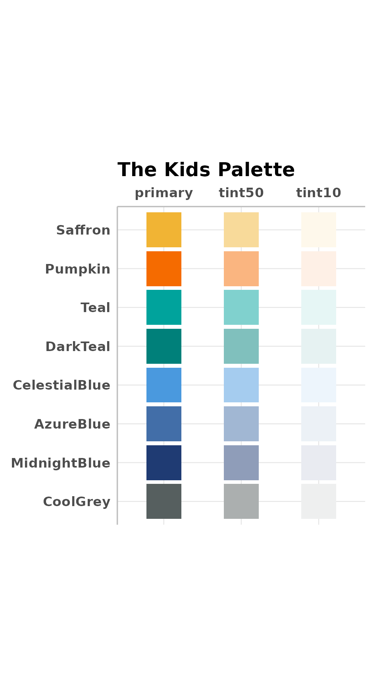
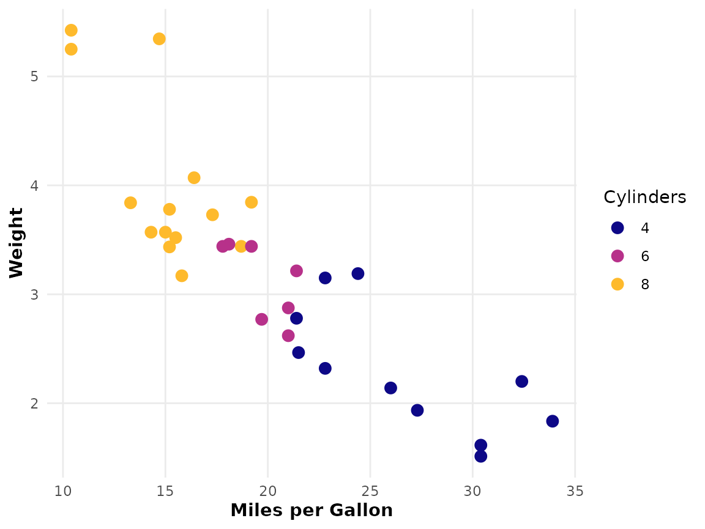
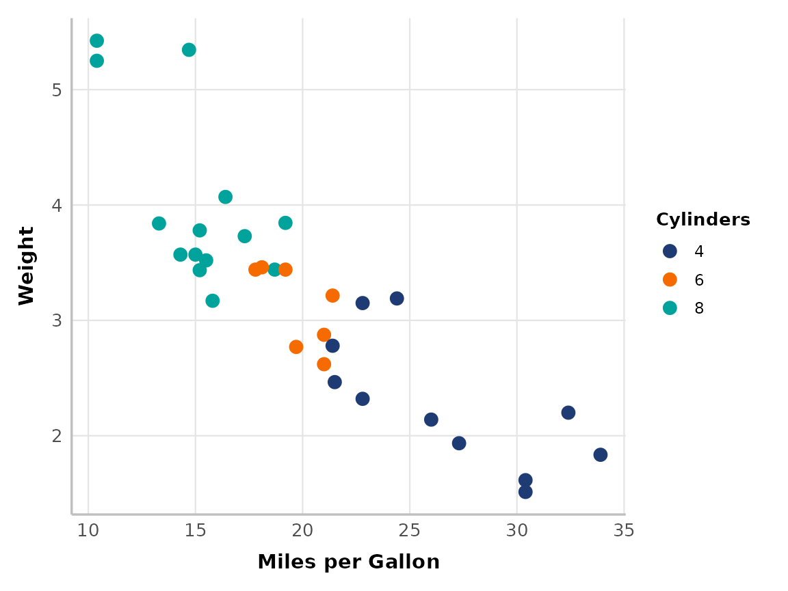

# The Kids Theming

## Overview

Using functions that automatically apply a set of formatting options to
plots and tables saves time, allowing us to focus on the analysis and
interpretation. Code will also look much cleaner when those ~10 repeated
lines of ggplot for each plot are automated away. Importantly, these
functions also ensure a polished and consistent appearance across our
team, so that outputs look the same irrespective of who generated it.

``` r

library(thekidsbiostats)
```

All theming functions host a variety of other options that can further
tweak the overall look of plots and tables (including colours).

### The Kids Colours

Colours, consistent with “The Kids” brand guidelines, can be accessed
directly via `thekids_colours` list:

| Colour        | Primary       | 50%              | 10%              |
|---------------|---------------|------------------|------------------|
| Saffron       | saffron       | saffron_50       | saffron_10       |
| Pumpkin       | pumpkin       | pumpkin_50       | pumpkin_10       |
| Teal          | teal          | teal_50          | teal_10          |
| DarkTeal      | darkteal      | darkteal_50      | darkteal_10      |
| CelestialBlue | celestialblue | celestialblue_50 | celestialblue_10 |
| AzureBlue     | azureblue     | azureblue_50     | azureblue_10     |
| MidnightBlue  | midnightblue  | midnightblue_50  | midnightblue_10  |
| CoolGrey      | coolgrey      | coolgrey_50      | coolgrey_10      |

  

The colours can be visualised with the
[`thekids_showpalette()`](https://the-kids-biostats.github.io/thekidsbiostats/reference/thekids_showpalette.md)
function, i.e.

``` r

thekids_showpalette()
```



  
  

## Example Usage

### `> The Kids theming functions`

The `thekids_theme`, `scale_colour_thekids` and `scale_fill_thekids`
functions are useful to apply consistent theming to `ggplot2`
visualisations. These use a clean, minimal aesthetic with fonts that
align with “The Kids” branding. Here’s an example of a plot
before-and-after theming:

``` r

ggplot(mtcars, aes(x = mpg, y = wt, colour = factor(cyl))) +
  geom_point(size = 3) +
  labs(x = "Miles per Gallon", y = "Weight", colour = "Cylinders")
```



  
  

``` r

ggplot(mtcars, aes(x = mpg, y = wt, colour = factor(cyl))) +
  geom_point(size = 3) +
  labs(x = "Miles per Gallon", y = "Weight", colour = "Cylinders") +
  thekids_theme() +
  scale_colour_thekids()
```



  

*Miles* better! And as simple as just adding these lines of code:
`thekids_theme() + scale_colour_thekids()`.

### `> thekids_table`

`thekids_table` produces tables styled with The Kids branding and is
powered by the
[flextable](https://cran.r-project.org/web/packages/flextable/index.html)
package. By default, this function applies the Barlow font, compact
formatting (our preference!), and zebra-striping for readability. Note
that these can all be altered/disabled via parameters (see
[`?thekids_table`](https://the-kids-biostats.github.io/thekidsbiostats/reference/thekids_table.md)
documentation).

For example, a raw table output from the mtcars dataset looks like this:

``` r

head(mtcars, 5)
#>                    mpg cyl disp  hp drat    wt  qsec vs am gear carb
#> Mazda RX4         21.0   6  160 110 3.90 2.620 16.46  0  1    4    4
#> Mazda RX4 Wag     21.0   6  160 110 3.90 2.875 17.02  0  1    4    4
#> Datsun 710        22.8   4  108  93 3.85 2.320 18.61  1  1    4    1
#> Hornet 4 Drive    21.4   6  258 110 3.08 3.215 19.44  1  0    3    1
#> Hornet Sportabout 18.7   8  360 175 3.15 3.440 17.02  0  0    3    2
```

Now, applying `thekids_table` transforms it into a clean, visually
appealing format with branded elements:

``` r

head(mtcars, 5) %>%
  thekids_table(colour = "saffron", fontsize = 10)
#> Warning in check_font_family(font_family = font_family, fallback_family =
#> fallback_font_family): Font 'Barlow' not found; falling back to 'sans'.
```

| mpg  | cyl | disp | hp  | drat | wt    | qsec  | vs  | am  | gear | carb |
|------|-----|------|-----|------|-------|-------|-----|-----|------|------|
| 21.0 | 6   | 160  | 110 | 3.90 | 2.620 | 16.46 | 0   | 1   | 4    | 4    |
| 21.0 | 6   | 160  | 110 | 3.90 | 2.875 | 17.02 | 0   | 1   | 4    | 4    |
| 22.8 | 4   | 108  | 93  | 3.85 | 2.320 | 18.61 | 1   | 1   | 4    | 1    |
| 21.4 | 6   | 258  | 110 | 3.08 | 3.215 | 19.44 | 1   | 0   | 3    | 1    |
| 18.7 | 8   | 360  | 175 | 3.15 | 3.440 | 17.02 | 0   | 0   | 3    | 2    |

### Table Highlighting

The `highlight` and `zebra` arguments are useful for highlighting rows
within a table.

  

#### \> `highlight`

Set the specific rows to highlight by passing a vector of indices to
`highlight`:

``` r

head(mtcars, 6) %>%
  thekids_table(colour = "saffron", highlight = c(2, 5))
#> Warning in check_font_family(font_family = font_family, fallback_family =
#> fallback_font_family): Font 'Barlow' not found; falling back to 'sans'.
```

| mpg  | cyl | disp | hp  | drat | wt    | qsec  | vs  | am  | gear | carb |
|------|-----|------|-----|------|-------|-------|-----|-----|------|------|
| 21.0 | 6   | 160  | 110 | 3.90 | 2.620 | 16.46 | 0   | 1   | 4    | 4    |
| 21.0 | 6   | 160  | 110 | 3.90 | 2.875 | 17.02 | 0   | 1   | 4    | 4    |
| 22.8 | 4   | 108  | 93  | 3.85 | 2.320 | 18.61 | 1   | 1   | 4    | 1    |
| 21.4 | 6   | 258  | 110 | 3.08 | 3.215 | 19.44 | 1   | 0   | 3    | 1    |
| 18.7 | 8   | 360  | 175 | 3.15 | 3.440 | 17.02 | 0   | 0   | 3    | 2    |
| 18.1 | 6   | 225  | 105 | 2.76 | 3.460 | 20.22 | 1   | 0   | 3    | 1    |

  

By default, the colour used for highlighting is defined as a 50% lighter
tinted version of the colour given to the header. This can be changed by
providing a named colour (including any The Kids colours) or hex code to
the `highlight_colour` argument.

``` r

head(mtcars, 6) %>%
  thekids_table(
    colour = "teal", 
    highlight = c(2, 5), highlight_colour = 'lightblue'
  )
#> Warning in check_font_family(font_family = font_family, fallback_family =
#> fallback_font_family): Font 'Barlow' not found; falling back to 'sans'.
```

| mpg  | cyl | disp | hp  | drat | wt    | qsec  | vs  | am  | gear | carb |
|------|-----|------|-----|------|-------|-------|-----|-----|------|------|
| 21.0 | 6   | 160  | 110 | 3.90 | 2.620 | 16.46 | 0   | 1   | 4    | 4    |
| 21.0 | 6   | 160  | 110 | 3.90 | 2.875 | 17.02 | 0   | 1   | 4    | 4    |
| 22.8 | 4   | 108  | 93  | 3.85 | 2.320 | 18.61 | 1   | 1   | 4    | 1    |
| 21.4 | 6   | 258  | 110 | 3.08 | 3.215 | 19.44 | 1   | 0   | 3    | 1    |
| 18.7 | 8   | 360  | 175 | 3.15 | 3.440 | 17.02 | 0   | 0   | 3    | 2    |
| 18.1 | 6   | 225  | 105 | 2.76 | 3.460 | 20.22 | 1   | 0   | 3    | 1    |

  

#### \> `zebra`

If `zebra = TRUE`, then every other row will be highlighted.

``` r

head(mtcars, 6) %>%
  thekids_table(
    colour = "azureblue", 
    zebra = TRUE
  )
#> Warning in check_font_family(font_family = font_family, fallback_family =
#> fallback_font_family): Font 'Barlow' not found; falling back to 'sans'.
```

| mpg  | cyl | disp | hp  | drat | wt    | qsec  | vs  | am  | gear | carb |
|------|-----|------|-----|------|-------|-------|-----|-----|------|------|
| 21.0 | 6   | 160  | 110 | 3.90 | 2.620 | 16.46 | 0   | 1   | 4    | 4    |
| 21.0 | 6   | 160  | 110 | 3.90 | 2.875 | 17.02 | 0   | 1   | 4    | 4    |
| 22.8 | 4   | 108  | 93  | 3.85 | 2.320 | 18.61 | 1   | 1   | 4    | 1    |
| 21.4 | 6   | 258  | 110 | 3.08 | 3.215 | 19.44 | 1   | 0   | 3    | 1    |
| 18.7 | 8   | 360  | 175 | 3.15 | 3.440 | 17.02 | 0   | 0   | 3    | 2    |
| 18.1 | 6   | 225  | 105 | 2.76 | 3.460 | 20.22 | 1   | 0   | 3    | 1    |

  

If instead you want the highlighted rows to alternate in chunks of two
or more rows, then an integer can be supplied to `zebra` indicating the
row chunk size.

``` r

head(mtcars, 6) %>%
  thekids_table(
    colour = "azureblue", 
    zebra = 2
  )
#> Warning in check_font_family(font_family = font_family, fallback_family =
#> fallback_font_family): Font 'Barlow' not found; falling back to 'sans'.
```

| mpg  | cyl | disp | hp  | drat | wt    | qsec  | vs  | am  | gear | carb |
|------|-----|------|-----|------|-------|-------|-----|-----|------|------|
| 21.0 | 6   | 160  | 110 | 3.90 | 2.620 | 16.46 | 0   | 1   | 4    | 4    |
| 21.0 | 6   | 160  | 110 | 3.90 | 2.875 | 17.02 | 0   | 1   | 4    | 4    |
| 22.8 | 4   | 108  | 93  | 3.85 | 2.320 | 18.61 | 1   | 1   | 4    | 1    |
| 21.4 | 6   | 258  | 110 | 3.08 | 3.215 | 19.44 | 1   | 0   | 3    | 1    |
| 18.7 | 8   | 360  | 175 | 3.15 | 3.440 | 17.02 | 0   | 0   | 3    | 2    |
| 18.1 | 6   | 225  | 105 | 2.76 | 3.460 | 20.22 | 1   | 0   | 3    | 1    |

  

… and if you want to reverse the ordering such that the first rows
initiate the highlighting pattern, a negative sign can be added to the
`zebra` value. For example, `zebra=-1` reverses the result of `zebra=1`
(or equivalently `zebra=TRUE`)

``` r


head(mtcars, 6) %>%
  thekids_table(
    colour = "azureblue", 
    zebra = -2
  )
#> Warning in check_font_family(font_family = font_family, fallback_family =
#> fallback_font_family): Font 'Barlow' not found; falling back to 'sans'.
```

| mpg  | cyl | disp | hp  | drat | wt    | qsec  | vs  | am  | gear | carb |
|------|-----|------|-----|------|-------|-------|-----|-----|------|------|
| 21.0 | 6   | 160  | 110 | 3.90 | 2.620 | 16.46 | 0   | 1   | 4    | 4    |
| 21.0 | 6   | 160  | 110 | 3.90 | 2.875 | 17.02 | 0   | 1   | 4    | 4    |
| 22.8 | 4   | 108  | 93  | 3.85 | 2.320 | 18.61 | 1   | 1   | 4    | 1    |
| 21.4 | 6   | 258  | 110 | 3.08 | 3.215 | 19.44 | 1   | 0   | 3    | 1    |
| 18.7 | 8   | 360  | 175 | 3.15 | 3.440 | 17.02 | 0   | 0   | 3    | 2    |
| 18.1 | 6   | 225  | 105 | 2.76 | 3.460 | 20.22 | 1   | 0   | 3    | 1    |
