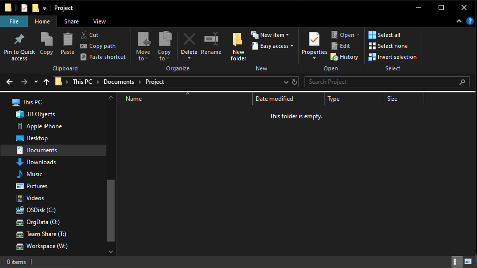
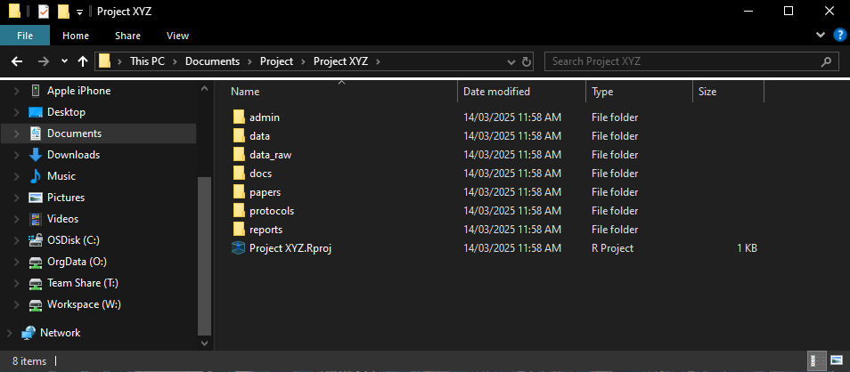
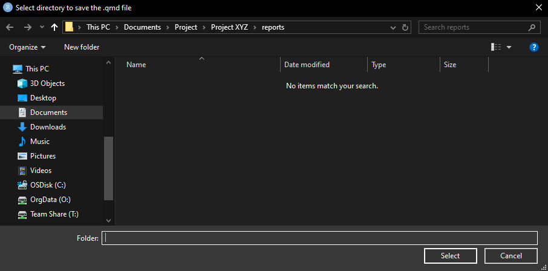
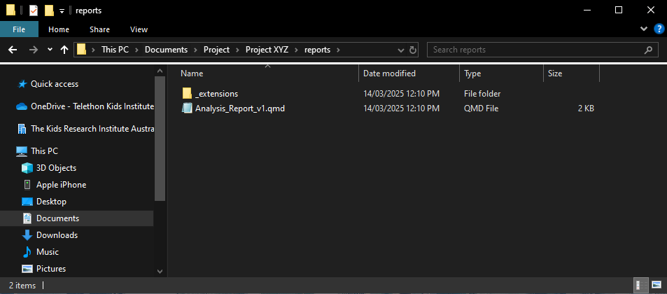
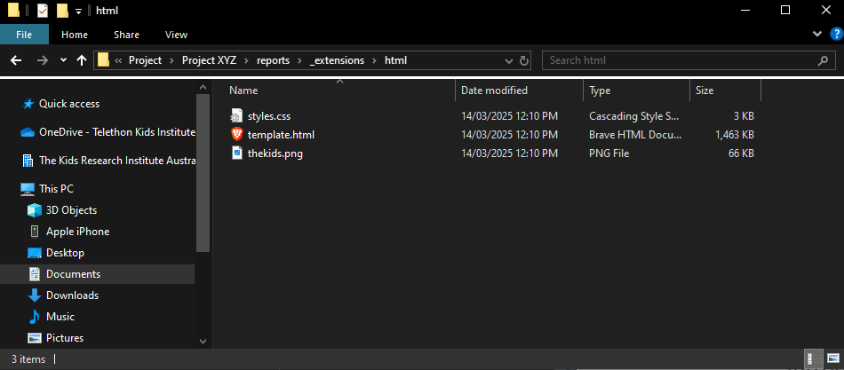
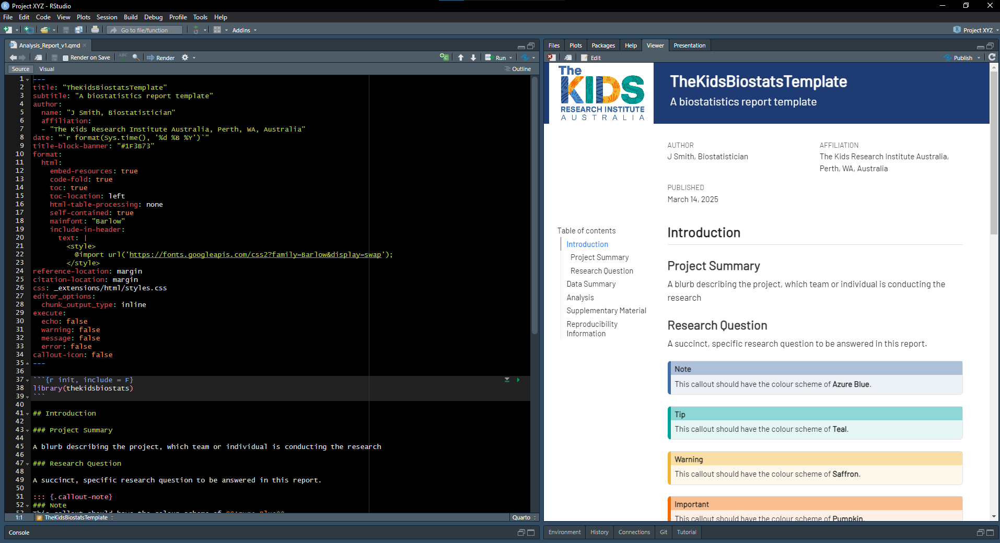

```{r, include = FALSE}
knitr::opts_chunk$set(
  collapse = TRUE,
  comment = "#>"
)

library(gifski)
library(magick)
```

# Overview

```{r echo=TRUE, message=FALSE, warning=FALSE}
library(thekidsbiostats)
```

# Organising Statistical Workflows

## Step 1: Create folder structure

+ Let's create the following project:
  + Project is called "Project XYZ".
  + I will not be leveraging Targets for this project so, in this instance, can set `ext_name = "basic"`.
  + I would like all "default" folders (admin, data, data_raw, docs, reports).
  + In addition to the above, I would like a folder for "protocols" and "papers".

```{r echo=TRUE, eval=FALSE}
create_project(project_name = "Project XYZ", 
               ext_name = "basic",
               other_folders = c("protocols", "papers"))
```

{width=100%}

{width=100%}


## Step 2: Create (Quarto) markdown template

+ How I would like to generate a Quarto markdown document organise and present analysis.
  + I would like to name this report "Analysis_Report_v1"

```{r echo=TRUE, message=T, eval=FALSE}
create_template(file_name = "Analysis_Report_v1",
                ext_name = "html")
```

{width=100%}


{width=100%}


{width=100%}

{width=100%}

# Enhancing Report Readbility Using Add-Ins 

## Reproducibility Information

```{r}
sessionInfo()
```

